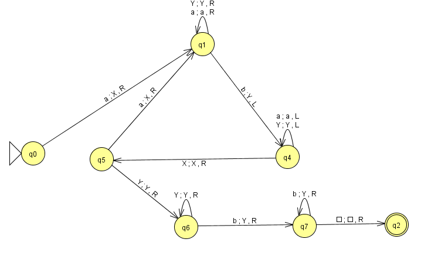
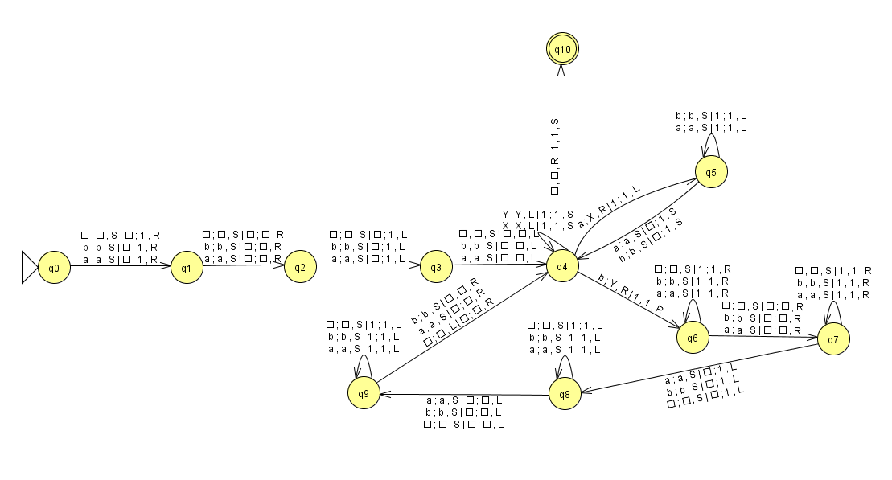

# Deterministic Turing Machine Simulator 

## 📜 Descripción General

This project consists of implementing a deterministic Turing machine simulator. A `MultiTapeTuringMachine` class has been developed that allows loading the machine's configuration from a file and simulating its behavior with a given input.  
Additionally, an extension has been implemented that allows working with multi-tape machines, where each tape has an independent behavior but is coordinated by the same set of transitions.

## 📄 Configuration File Format

The automaton configuration file must follow this format:

```bash
# Comments (optional)

q0 q1 q2 q3 q4 q5 q6  # Automaton states (Q)
a b                   # Language symbols (Σ)
a b X Y .             # Tape symbols (Γ)
q0                    # Initial state
.                     # Blank tape symbol
q6                    # Final state
1                     # Number of tapes  
q0 a q1 X R           # Transitions  
...
```

## ⚙️ Implemented Turing Machine Type

| Feature | Description |
|-----------------|--------------|
| **Movements** | `L`, `R` and `S` (no movement) are allowed. |
| **Writting and movement** | Performed simultaneously in each transition. |
| **Tape** | Infinite in both directions. |
| **Number of tapes** | The **multi-tape** version has been implemented as an additional feature. |

## 🧩 Project Structure  

┣ 📂 CFiles/    
┃ ┣ [MT_1.txt](CFiles/MT_1.txt)  
┃ ┣ [MT_2.txt](CFiles/MT_2.txt)  
┃ ┗ [MT_Ejemplo.txt](CFiles/MT_Ejemplo.txt)  
┣ 📂 include/    
┃ ┣ [alphabet.hpp](include/alphabet.hpp)  
┃ ┣ [color.hpp](include/color.hpp)  
┃ ┣ [multi-tape_state.hpp](include/multi-tape_state.hpp)  
┃ ┣ [multi-tapeTM.hpp](include/multi-tapeTM.hpp)    
┃ ┣ [state.hpp](include/state.hpp)  
┃ ┣ [symbol.hpp](include/symbol.hpp)  
┃ ┣ [tape.hpp](include/tape.hpp)  
┃ ┣ [TM.hpp](include/TM.hpp)  
┃ ┣ [transition.hpp](include/transition.hpp)  
┃ ┗ [types.hpp](include/types.hpp)  
┣ 📂 InputFiles/    
┃ ┣ [input-1.txt](InputFiles/input-1.txt)  
┃ ┣ [input-2.txt](InputFiles/input-2.txt)  
┃ ┗ [input-Ejemplo.txt](InputFiles/input-Ejemplo.txt)  
┣ 📂 src/    
┃ ┣ [main.cpp](src/main.cpp)  
┃ ┣ [multi-tapeTM.cpp](src/multi-tapeTM.cpp)  
┃ ┣ [multi-tape_state.cpp](src/multi-tape_state.cpp)  
┃ ┗ [tape.cpp](src/tape.cpp)  
┗ 🛠️ [CMakeLists.txt](CMakeLists.txt)  

## 🧠 Main Components

| Class | Description | File/Localitation |
|--------|--------------|-----------------|
| `Symbol` | Represents an input alphabet or tape symbol. | `symbol.hpp` |
| `Alphabet` | Represents the Turing machine's alphabet. | `alphabet.hpp` |
| `Movement` | Enumerates the possible movements of the read/write head. | `types.hpp` |
| `TransitionParams` | Structure with the parameters of a transition (`símbolo leído`, `estado siguiente`, `símbolo escrito`, `movimiento`). | `types.hpp` |
| `Transition` | Defines a specific transition of the machine. | `transition.hpp` |
| `Tape` | Implements the tape as a doubly linked list, with infinite movements on both sides. | `tape.hpp` |
| `MultiTapeState` | Represents a machine state and its associated transitions. | `state.hpp` |
| `MultiTapeTuringMachine` | Main class that simulates the execution of a deterministic multi-tape Turing Machine. | `multi_tape_tm.hpp` |

## 🏗️ Compilation, Build, and Execution

To compile the project, the `CMake`build system must be used. To do this, follow these steps:

1. Create a build directory inside the project's root directory:
   ```bash
   mkdir build
   cd build
   ```

2. Run `CMake` to configure the project:
   ```bash
   cmake ..
   ```

3. Compile the project using `make`:
   ```bash
   make
   ```

4. Run the simulator with an input file corresponding to each automaton by its number:
   ```txt
   ./DETERMINISTIC_TURING_MACHINE_SIMULATOR ../CFiles/MT_X.txt ../InputFiles/input-X.tm
   ```

## 🧪 Configuration Files Used

The Turing Machine **configuration files** are located in the `CFiles/` folder.  
Each defines a different machine with its own recognized language.

| File | Description | Recognized Language |
|----------|--------------|---------------------|
| **`CFiles/MT_1.txt`** | Machine that recognizes strings of the type `aⁿbᵐ` | L = { aⁿbᵐ ∣ m > n, n > 0 } |
| **`CFiles/MT_2.txt`** | Machine that recognizes strings from the alphabet {a, b} and writes the number of a's and b's with 1's on another tape | L = { w ∈ {a,b}* } |

## 💻 Turing Machines in JFLAP
1. TM that recognizes the language L = { aⁿbᵐ ∣ m > n, n > 0 }
   - 
2. TM that receives a string composed of 'a' and 'b' symbols as a parameter. The TM must replace the string with the number of 'a' symbols, followed by the number of 'b' symbols separated by a blank symbol. The number will be encoded as n = 1ⁿ⁺¹. . If the string is composed of symbols of the same type, the absence of the other symbol will be reflected with a "1".
   - 
